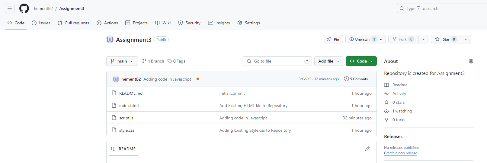
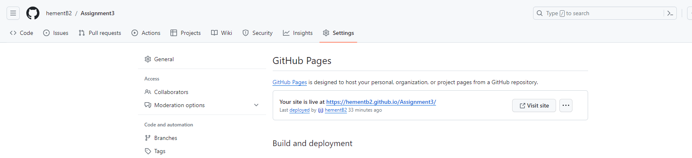
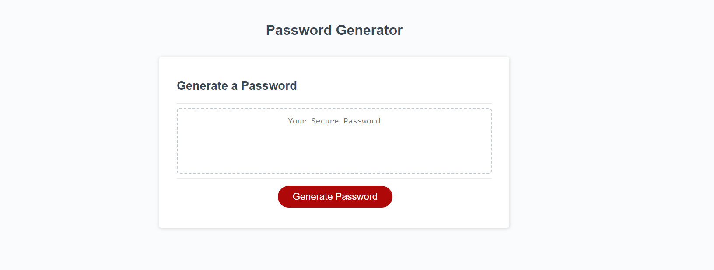

# Assignment3
Repository is created for Assignment3

## Assignment Details

This Assignment is a JavaScript-based Password Generator that enables user to generate random passwords based on specific criteria. The application runs in the browser and features a clean and responsive user interface. The generated passwords meet certain criteria, including options for length, and the inclusion of lowercase, uppercase, numeric, and special characters.

## Features of the Assignment

- Password Length: Users can choose a password length between 8 and 128 characters.

- Character Types: Users can include uppercase letters, lowercase letters, numbers, and special characters in their passwords.

- Random Generation: The application generates a random password based on the selected criteria.

## Usage

1. Open the index.html file in a web browser.

2. Click the "Generate Password" button.

3. Follow the prompts to select password criteria.

4. View the generated password.

## How to Run Locally
Clone the repository:

bash
Copy code
git clone git@github.com:hementB2/Assignment3.git
Open the project directory:

## Screenshots

1. Git Repository

2. Link to live web URL

3. Live Page

Regards,
Hement Mishra
